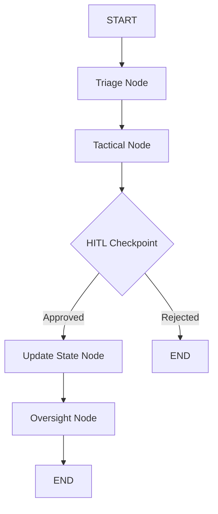

# AURORA TECH — Operational Flow & Multi-Agent Logic

## 1. The Autonomous Pipeline Lifecycle
The lifecycle of an emergency event in AURORA TECH follows a strictly orchestrated 4-stage pipeline.

### Stage 1: Multimodal Ingestion
- **Citizen Text**: Input via `/api/citizen/sos`.
- **Citizen Voice**: Input via `/api/citizen/voice-sos` or binary WebSocket stream.
- **Service**: `VoiceProcessor` (Faster-Whisper) converts audio to text.
- **Context Injection**: `SemanticMemory` retrieves the last 10 minutes of local incidents to provide situational context to the agents.

### Stage 2: Intelligence Extraction (Triage)
- **Agent**: `TriageAgent` (Gemma 4).
- **Process**: LLM performs zero-shot extraction into the `TriageIntelligence` schema.
- **Logic**: Calculates a `priority_score` (0.0 - 1.0) based on life-threat detection, victim count, and mobility status.

### Stage 3: Tactical Reasoning & Resource Allocation
- **Agent**: `TacticalAgent`.
- **Context**: Accesses shared state (Redis) and geo-spatial data (PostGIS).
- **Tools**:
  - `get_nearest_responders`: Spatial query for available units.
  - `get_hospital_capacity`: Real-time bed availability check.
  - `detect_route_failures`: OSMnx-based blockage detection.
- **Output**: A list of `TacticalAction` objects (e.g., "Dispatch Ambulance to Zone 4").

### Stage 4: Strategic Oversight & State Mutation
- **Agent**: `OversightAgent`.
- **Synthesis**: Compresses the entire incident landscape into an executive summary for the Command Center.
- **Commit**: `Update State` node writes to PostGIS and Redis.
- **Broadcast**: Publishes to `broadcast:admin` and `broadcast:responder` channels.

---

## 2. State-Machine Transitions (LangGraph)
The graph maintains an internal `GraphState` that accumulates data as it passes through nodes.

### Transition Logic:
- **`triage` → `tactical`**: Triggered immediately upon structured intelligence extraction.
- **`tactical` → `update_state`**: Blocked by an **Interrupt**. The graph state is saved. The process only continues when a `POST` request is received from an authenticated Admin.
- **`update_state` → `oversight`**: Occurs after operational memory is committed, ensuring the oversight briefing reflects the latest reality.

---

## 3. Data Integrity & Concurrency
- **Atomic Operations**: All Redis updates use pipelines (`LPUSH` + `LTRIM`) to ensure the "Operational State" is never corrupted by parallel agent executions.
- **Thread Safety**: Each incident is keyed by a unique `thread_id`, allowing AURORA to scale horizontally across multiple worker instances while maintaining independent conversation/incident history.
