# AURORA TECH — System Walkthrough & Operational Workflow

This guide provides a step-by-step walkthrough of the AURORA TECH platform, explaining how the AI agents and infrastructure coordinate to manage a disaster scenario.

## 1. High-Level Workflow Diagram

The following diagram visualizes the end-to-end flow from a Citizen's distress signal to a Responder's deployment.

```mermaid
sequenceDiagram
    participant C as Citizen (SOS Portal)
    participant B as FastAPI Backend
    participant LG as LangGraph (AI Agents)
    participant R as Redis (Shared State)
    participant A as Admin (Command Center)
    participant RE as Responder (Tactical App)

    C->>B: Submit Voice/Text SOS
    B->>B: VoiceProcessor (STT) if Audio
    B->>LG: Trigger Disaster Graph (Thread ID)
    
    rect rgb(40, 44, 52)
    Note over LG: AI Reasoning Phase
    LG->>LG: TriageAgent: Extract Intelligence
    LG->>LG: TacticalAgent: Reason Resources
    end

    LG-->>B: INTERRUPT (Wait for HITL)
    B->>R: Save State & Publish to Admin
    R-->>A: WebSocket: "New Pending Incident"
    
    Note over A: Admin Reviews Tactical Proposal
    A->>B: POST /api/admin/approve
    
    B->>LG: RESUME Graph Execution
    LG->>LG: Update State (PostGIS/Redis)
    LG->>LG: OversightAgent: Global Synthesis
    
    B->>R: Publish Dispatch Event
    R-->>RE: WebSocket: "New Dispatch Order"
    RE->>RE: Display Tactical Briefing
```

---

## 2. Step-by-Step Functional Walkthrough

### Step 1: Citizen SOS Ingestion
- **Action**: A citizen in distress opens the SOS portal and either types a message or uses the **Voice SOS** button.
- **Backend Logic**:
    - If voice is used, `Faster-Whisper` transcribes the audio in real-time.
    - The `SemanticMemory` service fetches local context (recent nearby incidents).
    - A unique `thread_id` is created for this specific emergency.

### Step 2: The AI Triage & Tactical Phase
- **Action**: The `LangGraph` pipeline begins.
- **Agent Logic**:
    - **TriageAgent**: Analyzes the message to determine severity (Critical/High/Low), victim count, and mobility status.
    - **TacticalAgent**: Queries `TacticalTools` to find the nearest available responders in PostGIS and checks hospital capacity in Redis.
- **State**: The graph **stops** here. This is a safety feature. The system will not dispatch units without human authorization.

### Step 3: Admin Strategic Oversight
- **Action**: The Admin sees a pulsing red alert on their map. They click the incident to see the AI's "Tactical Recommendation."
- **Admin Logic**: The Admin reviews the justification provided by the AI (e.g., "Dispatching Ambulance 01 due to critical injury and 1.2km proximity").
- **Decision**: The Admin clicks **Approve**.

### Step 4: Real-time Dispatch & Coordination
- **Action**: The graph resumes.
- **System Logic**: 
    - The incident is committed to the PostGIS permanent ledger.
    - A broadcast is sent through Redis Pub/Sub.
    - The **Responder Dashboard** instantly updates with the incident details, safe-route suggestions, and victim status.

### Step 5: Global Synthesis
- **Action**: The `OversightAgent` updates the Command Center with a new "Global Efficiency Score" and an updated briefing that includes the latest dispatch.
- **Outcome**: The platform maintains a live, synchronized "Common Operational Picture" (COP) for all roles.

---

## 3. Operational Safety Features
- **Interrupts**: No life-critical decisions are made without human-in-the-loop (HITL) approval.
- **Distributed Locking**: Redis locks prevent two admins from approving the same resource simultaneously.
- **Edge Fallback**: If the cloud LLM (Gemma 4) fails, the `LLMGateway` automatically falls back to local `Ollama` instances to ensure the triage pipeline never goes down.
